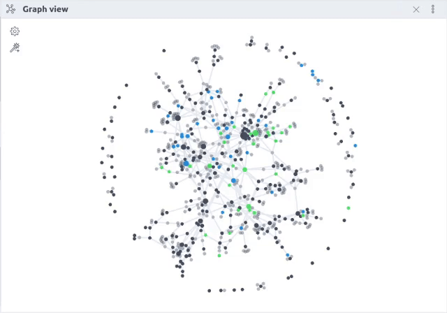

## Obsidian Persistent Graph Plugin

> [!WARNING]
> **This project is looking for a new maintainer.**  It might work for your purposes, but there are [issues people would like to see fixed](https://github.com/Sanqui/obsidian-persistent-graph/issues) that I'm unable to devote time to solve currently.  If you are interested in taking over the development of the plugin, please send me an email at me@sanqui.net.

This is a plugin for Obsidian (https://obsidian.md).

Graph lovers, rejoice!

Do you love using the global graph as a powerful spatial tool, but cry every time Obsidian restarts and all nodes lose their place?  Would you like to retain the shape of your graph over a long time?  Well then this plugin is for you.

This plugin adds commands to save and restore the locations of nodes on your graph.  There's also a setting to restore automatically whenever you open a new graph view.  That's it, it's that simple!  And as a bonus I also added a command to continuously run the graph simulation so you don't have to jiggle it.

Please note that this plugin makes use of internal Obsidian APIs, so it may break with updates, and it's unlikely to be accepted as a community plugin.  This feature is so important to me that I built it nonetheless, so if you're brave you can enjoy it with me!

Possible future features:
- Automatic/periodic saving
- Restoring when graph view is open
- Save & restore graph settings like filters

- Locking nodes in place
